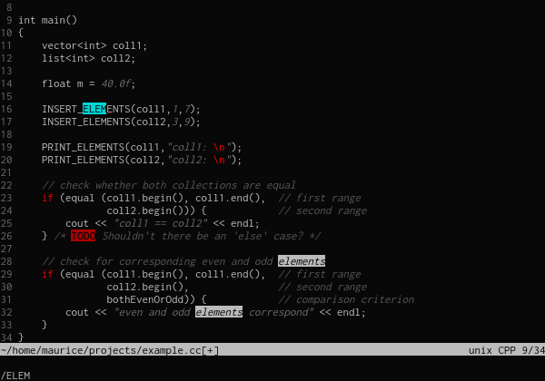
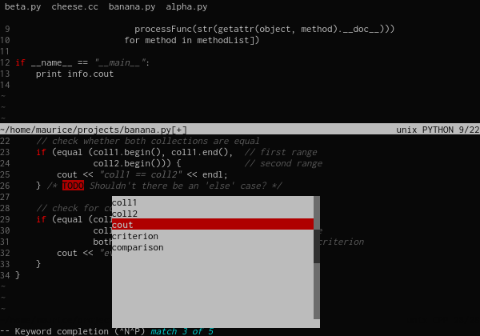
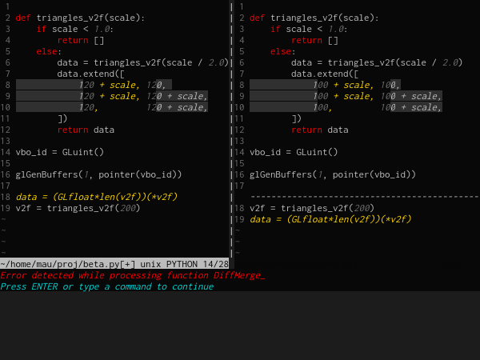

# minimaldark257.vim

My custom Vim dark theme for 256-color terminals, highlighting gray, red, and cyan accents.

## Screenshots

From: [Vivify](https://bytefluent.com/vivify/index.php)







## Installation

### Vim-Plug

1. Add the following line to your `~/.vimrc`:

```vim
Plug 'dot-richard/minimaldark256.vim'
```

2. Reload your `~/.vimrc` or restart Vim, then run:

```vim
:PlugInstall
```

### Vundle

1. Add the following line to your `~/.vimrc`:

```vim
Plugin 'dot-richard/minimaldark256.vim'
```

2. Reload your `~/.vimrc` or restart Vim, then run:

```vim
:PluginInstall
```

### Pathogen

1. Navigate to your Vim configuration directory:

```shell
cd ~/.vim/bundle
```

2. Clone the repository:
    git clone https://github.com/dot-richard/minimaldark256.vim.git

### Dein

1. Add the following line to your `~/.vimrc`:

```vim
call dein#add('dot-richard/minimaldark256.vim')
```

2. Reload your `~/.vimrc` or restart Vim, then run:

```vim
:call dein#install()
```

### Manual Installation

Clone the repository into your `~/.vim/colors` directory :

```shell
git clone https://github.com/dot-richard/minimaldark256.vim.git ~/.vim/colors/minimaldark256
```

## Usage

To start using the minimaldark256 theme, add the following to your `~/.vimrc`:

```vim
set background=dark
colorscheme minimaldark256
```

## Customization

Feel free to customize the theme to fit your personal preferences. You can edit the color definitions and styles directly in the `minimaldark256.vim` file.

## Contributing

Contributions are welcome! If you have suggestions, bug reports, or improvements, please create an issue or submit a pull request on GitHub.

## License

This theme is licensed under the MIT License. See the LICENSE file for more details.

